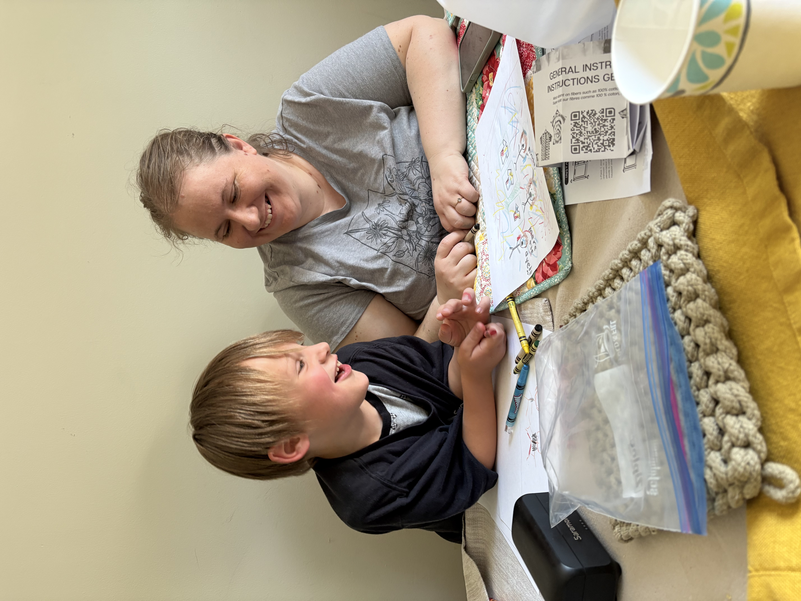
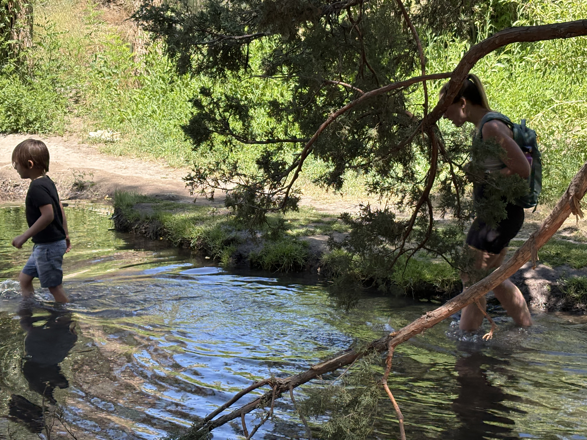

Emily and Calvin spent a month and a half in Utah while Calvin was out of school for the summer. I stayed home for a month so I could keep working. Technically I can work from anywhere, but I have a fair amount of hardware that I use when testing various functions of our software, and it's hard to lug it all to a different place. Also, I tend to have an easier time being emotionally stable when I'm at home in my home environment.

Emily sent me pictures from her time there. I did go and visit for a couple of weeks in July, before we all flew home to Owasso.

## Centerville, Utah

Emily's Dad built a treehouse for the (grand)kids to play in. Calvin got to participate in the construction project. He's taken an interest in tools and the various things one can do with them, so I'm glad he was able to be there to help grandpa.

He was able to spend a lot of quality time with people he doesn't see very often. In Utah he always gets to work on cars with people who actually know stuff about them. He's also been able to go on regular outings with Rob. Overall I'm glad he's been able to have more experiences with extended family - it also makes me wish we lived closer.

Calvin and his cousin Leo have developed a (very cute) friendship. Calvin loves making Leo laugh.

Some classic summer activities were had: ice cream as big as your head, water slides, worms, and volcanoes.

## 4th of July

Of course, there was the Fourth of July. Calvin got to ride a World War II-era jeep in the parade and throw candy.

## Reunited in Utah

I flew in to Utah on the fifth of July. We all went to Lagoon, which I hadn't been to since I was a teenager. We didn't know how long Calvin would go before getting tired of it. Turns out about half the day. 

Since Emily loves rollercoasters, I tried to figure out how she could come back later and ride some, but Calvin is too used to her doing bedtime and it seemed apparent that it just wasn't going to work. So I ended up going by myself, although I didn't last long either since apparently I get motion sickness now. I remember riding Colossus back in the day, which seemed like the craziest ride there. Now it feels old, even a little tame (but still fun). I went on Cannibal which is certainly neither tame nor old  - and I nearly puked.

We took advantage of a rare opportunity of having a babysitter and ventured outside together without a child in tow. We went barhopping in Salt Lake City with Rob, Cassi, and Keaton. It was really fun to see the variety of types of bars. There was the classic sit down restaurant with a big drink menu place, there was a "barcade" packed full of pinball machines and other retro games. There was a fun (and loud) live music bar. And then there was "dancing in the dimly lit club". At that point we were kinda wiped out. This was the only picture I got:

## Rexburg

After I arrived, we took a short trip up to Rexburg, which was as familiar as it was surreal. Calvin was 3 when we moved but he remembers some of the old spots - like the parks - that we used to go to. We had fun going on one of our favorite hikes, which always included playing in the water. We used to play in much shallower water last time we were there and Calvin was 2 and 3 years old.

We visited our favorite restaurant, Bud Juds. We also went to a pizza place called Righteous Slice. We didn't frequent that one as much but we figured Calvin would be happy about getting pizza.

In the Airbnb house we stayed at, we played a game called Buildzi - from the same company that makes Tenzi. We all enjoyed it so we ended up purchasing it when we got home. It's sort of like a board game version of Tetris.

## Hurricane

From there, we headed south to Hurricane for the annual summer vacation. Calvin's favorite part was the pool, and that's where he spent the majority of his time. He's especially been enjoying jumping into the pool, with one of us catching him.

## Starting Kindergarten
Calvin started Kindergarten. We all had lots of feelings about this. Calvin was understandably very reluctant to be away from home for so long every day in a new environment. We enjoy having him at home too, and it's a difficult step to take to have him gone during the day. Of course he had a couple years of preschool, but that was only three days a week, for less hours in the day. 

Calvin has mentioned he's bored with learning the letters of the alphabet, since he already learned them (quite well I should add). We've been concerned about him being bored at school, and have considered putting him in a private school nearby. But we'll wait and see how it goes. He's also mentioned he's frustrated that they're not learning about engineering. We had to explain to him that you don't jump right into learning about engineering, you have to learn a few things first.

Emily told him she's going back to school too, and he was excited because he thought she was going to learn about "pedal power" and she would be able to teach him. We explained that she's going to be learning about how the brain works, not engineering. He wasn't impressed.

I really do hope that public education doesn't beat the curiousity out of him. He's so bright and curious, and I want to encourage that as much as I can. But there's a lot that's not in our control.

While the first week was a tough transition from summer, he's since made a friend and seems to be enjoying school more.

## Owasso

Back at home in Owasso, I think Calvin enjoyed visiting the familiar places he'd missed while in Utah. 

Lately, he'd been enjoying picking up trash around the neighborhood, so we did that again a couple of times. I enjoy making the environment more pleasant in the neighborhood, though it’s also a bit of a bummer to see how casually people leave trash around.

Throwing rocks in water seems to be the evergreen activity.

As are Hot Wheel cars. It's moments like this when we realize just how many cars we've accumulated over the years. 

Calvin has been a fan of a YouTube channel that shows someone playing a car driving game (BeamNG) where each video is cars driving over/through various obstacles which often results in spectacular crashes. I downloaded the game, and he's enjoyed watching me finding inventive ways to crash cars. Recently, I showed him he can press the 'up' key to drive the car himself. So now he drives cars along a drag strip, and keeps going long after the road ends, until it crashes. He's learned to navigate selecting new cars himself, and changing the camera angles.

He also likes to play games with us occasionally. We bought a Nintendo Switch (1) a few months ago and have been enjoying playing new-to-us games, meaning Mainly Mario Kart and Mario Party.

Calvin loves watching a show called "What's Inside", where people take various things apart to see what it's made of. Emily took him to the local thrift store to get some cheap electronics he could take apart. He had fun taking them apart with a screwdriver until his attention span was depleted, then he used a hammer.

Back home, we "work on" our broken Camry. I have been learning more about cars, and I'm doing my best to make it interesting for him, but I still have a lot to learn. I wouldn't be surprised if there comes a point where he will be teaching me.

We've been taking regular trips to a fast food restaurant called Zaxby's. We typically get an order of fries and the 3 for 2 dollar cookie special. He loves taste testing different combinations of sauces - or rather, making me eat them and seeing how I react. There's been some horrific concoctions that made me queasy. Truthfully, it's not my favorite activity. I finally had to put my foot down and say we're not doing pure mustard anymore, and that's improved the situation somewhat.

We've also been continuing our trips to Starbucks. We open up all the cups on sale to see the "secret message" inside.

We're almost at the point where he's too big for his toy lawnmower he's been playing with since he was less than a year old. Eventually that sad day will come, but I try to remember to take pictures every time he uses it so I can make a collage someday.

## That's all the words I have, but here, have some funny pictures

